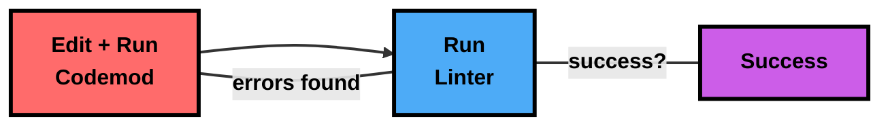

AI coding assistants like Cursor are incredibly good at making changes to your code. But there's a class of programming tasks they can't handle: large-scale, systematic modifications across an entire codebase. You wouldn't ask an AI to delete all dead code or reorganize your entire component hierarchy - the tooling just isn't there.

That's where codemods come in. A codemod is a program that operates on your codebase, and when you give an AI agent the ability to write them, these tasks fall below the high-water mark of AI capabilities.

Here's a real example: we asked [Devin](https://docs.devin.ai/get-started/devin-intro) (an autonomous SWE agent) to "delete all dead code" from our codebase. Instead of trying to make hundreds of individual edits, Devin [wrote a codemod](https://github.com/codegen-sh/codegen/pull/660/files#diff-199b0c459adf1639f664fed248fa48bb640412aeacbe61cd89475d6598284b5f) that systematically removed unused code while handling edge cases like decorators and indirect references.

- [View the PR](https://github.com/codegen-sh/codegen/pull/660)
- [View on Devin](app.devin.ai/sessions/a49eac87da644fa9ac1144fe130b847e)

<Frame caption="Devin edits a codemod in response to linter errors">
    
</Frame>

This modifies over 40 files and correctly removes old code, passes lint + tests, etc.

What made this work?

Platform-level modifications - whether deleting dead code, migrating APIs, or reorganizing architecture - require a systematic approach. Devin operates like a state machine: write a codemod, run it through the linter, analyze failures, and refine. Each iteration adds handling for new edge cases until the codemod successfully transforms the entire codebase. This is the same cycle developers use for many large-scale refactors, just automated.



The nice part about this approach is that we don't have to blindly trust the AI. There's no magic - it's just a program we can run and verify through linter output. The codemod is easy to review, and we can update it if we need to add exceptions or edge cases. Much better than trying to manually review hundreds of individual edits.

## Try it yourself

Want to experience this yourself? Install the Codegen CLI in your Devin box:

```bash
uv tool install codegen --python 3.13
```

Then give Devin the following prompt:

```markdown
Hey @devin! Let's show the world how good you are at writing codemods.
Right now, in my repo codegen-sdk, I have a bunch of dataclasses. I want to move them all to files called types.py in the current directory they are in - systematically organizing it.
(You can ignore anything that is not in src/codegen)
In order to do this, I want you to use the codegen CLI. Here are the steps:
Call codegen init to set it up.
This will create a .codegen/.venv, which contains a python 3.13 installation w/ dependencies it will use to run
Call codegen create -d "...arrange dataclasses ..."
This will generate a first draft of the codemod
The codemod will be saved to .codegen/codemods/{name}
It will also include a text file in that directory that contains docs and relevant examples that are helpful.
Then you can run this codemod with codegen run {name}
This will handle codebase parsing + caching
Note: don't try to run the codemod file directly. It can get very confusing with codebase paths, virtualenvs, etc.
You can see the diff on the filesystem with git diff
Make sure that things got moved around correctly, tests still pass, lint passes, etc.
If there are changes you need to make after the first run
Edit the file  .codegen/codemods/{name}/{name}.py
 Call codegen reset - this will blow away all your changes outside of the .codegen directory
Got back to the codegen run {name} step - rinse, wash and repeat!
Once you have something working, the final PR should include:
all changes from the codemod
The codemod itself.
Lastly, do NOT go on any side quests here. Your total output should be the codemod + the types being rearranged. If there are side quests we will not merge your PR.
Godspeed, Devin! :rocket:  excited to see what you come up with
```

We'd love to hear how it works for you!